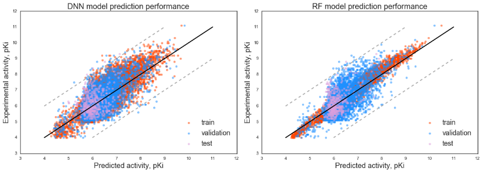

# predict_Kinase

Machine learning methods utilizing various structure-based and energy-based descriptors characterizing protein-ligand interactions to predict activity for novel compounds against a broad range of human kinases.

Predicting models are trained on the dataset of 104 human kinases with available PDB structures and with available experimental activity data against 1202 small-molecule compounds from PubChem BioAssay dataset ‘Navigating the Kinome’ (<https://pubchem.ncbi.nlm.nih.gov/bioassay/493040#section=Top>). Please check the paper ... for details.

The project contains Jupyter notebook scripts for models training, separate scripts for models evaluating, saved files with pre-trained models, bash-script for the pipeline to prepare descriptors for machine learning.

Kinase-ligand complexes in our pipeline are obtained with [SMINA](<https://sourceforge.net/projects/smina/>) docking software and docking scores are used as part of the descriptors set.

Descriptors preparation pipeline utilizes a number of tools and software, including
  - [SMINA](<https://sourceforge.net/projects/smina/>) for docking and pose scoring
  - [ICM](<http://www.molsoft.com/icm_pro.html>)
  - [PLIP](<https://github.com/ssalentin/plip>)
  - [X-Score](<http://sw16.im.med.umich.edu/software/xtool/>)
  - [ACPYPE](<https://github.com/t-/acpype/tree/dd608134cff5a5ff2b40288d9ccc37bad4d176e1>)
  - [GB_NSR6](<http://people.cs.vt.edu/onufriev/software.php>)
  - R

Most of these tools are freely available except for ICM-Pro, also it was used only on the steps 1 and 3 for a few operations and could be replaced by any other suitable programs. We used ICM in our pipeline particularly to save protein-ligand complex structures in PDB files after docking for further analysis and to calculate protein-ligand interaction surface (*ICM_area*), number of protein-ligand hydrogen bonds (*ICM_hbonds*), number of atoms in ligands (*nof_Atoms*), number of rotational bonds in ligands (*nof_RotB*).

Descriptors preparation pipeline can be run as `bash run_pipeline.sh`, please correct pathways to software in a header of the script.

Pipeline contains the following steps:

1. Calculate nof_Atoms and nof_RotB for ligands with ICM-Pro.
2. Calculate solvation energy for free ligands.
  - Prepare PQR files for ligands to run r6_born utility with Amber tools and ACPYPE script.
  - Run GB_NSR6 utility to calculate solvation energy of free ligands.
3. Run docking with SMINA and process docking results with ICM-Pro.
4. Re-score protein-ligand complexes with X-score.
5. Analyze protein-ligand contacts with PLIP (pyMol based tool).
6. Join tables into summary descriptors table 'test_compl_descr.tab' with R.

Kinases PDB files that should be used for our method are prepared as described in the paper ... and available in ... . Receptors list is available in file `recept.tab`. Number of descriptors associated with receptors are already pre-calculated and available in `tarSim_allPairs.tab`

The main script for activity prediction models' training can be found in Jupyter notebook file `train_main_model.ipynb`, the script contains descriptors table processing and construction and training of 2 activity predicting models: DNN model, built with Keras and Random Forest model from Scikit-learn library.

